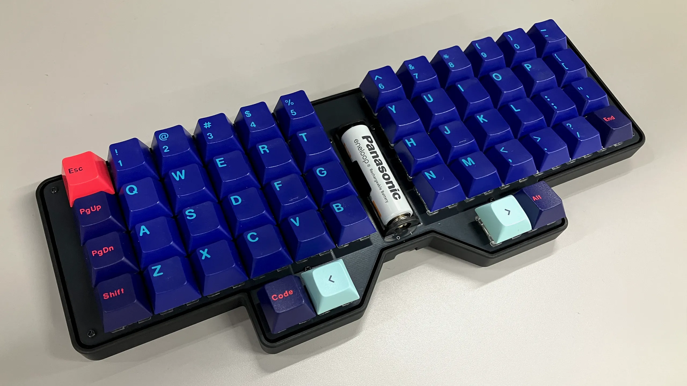

# Vespa

**[[BOOTHで販売中！]](https://pentronic-lab.booth.pm/items/7670599)**

The Vespa is a 50% wireless keyboard with an ortholinear layout.

- 52 keys
- MX/Choc hotswap
- Bluetooth and USB-C connectivity
- AA battery powered
- ZMK firmware with ZMK Studio support
